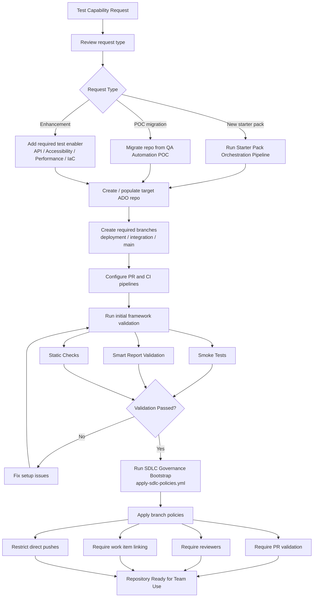
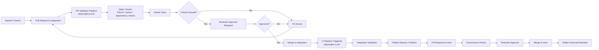
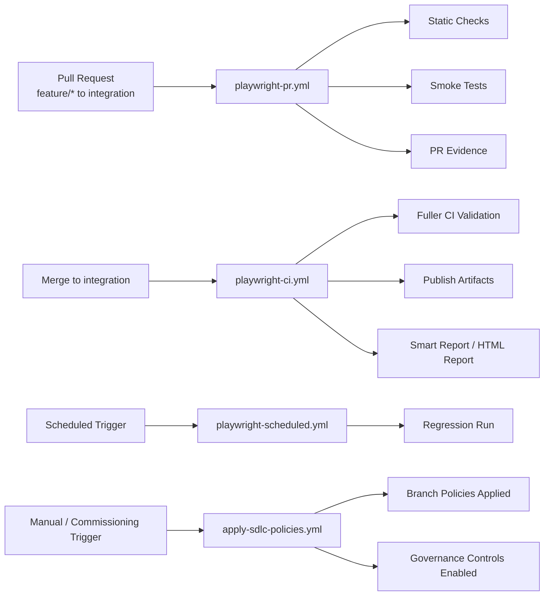

# 🚀 Starter Pack Repository Governance and SDLC Setup Guide

## Overview

This document describes the recommended repository governance, branch policies, permissions, and CI/CD controls for provisioned Playwright starter-pack repositories.

The purpose of this guide is to:

* Maintain consistent SDLC workflows
* Support code quality enforcement
* Ensure governance and auditability
* Reduce onboarding and setup effort
* Provide a repeatable operational model across teams

This guidance applies to repositories provisioned using the Test Capability orchestration pipeline and Playwright starter pack templates.

The following diagram represents the starter pack provisioning and governance bootstrap flow


---

# 1. Recommended Branch Strategy

## Standard Branch Flow

```text
feature/* → integration → main
```
---

## Branch Purpose

| Branch      | Purpose                                            |
| ----------- | -------------------------------------------------- |
| feature/*   | Development and enhancement work                   |
| integration | Shared integration and validation branch           |
| main        | Stable production-ready baseline                   |
| deployment  | Initial starter-pack deployment branch (temporary) |

## Notes

* Direct commits to `main` should be restricted.
* Pull Requests should be used for all merges.
* `deployment` can be deleted after successful onboarding and validation.

---

# 2. Repository Permissions

## Recommended Access Model

| Role           | Recommended Access              |
| -------------- | ------------------------------- |
| Contributors   | Push to feature branches        |
| Reviewers      | Approve Pull Requests           |
| Administrators | Manage repo and branch policies |
| Readers        | Read-only access                |

## Recommended Practices

* Restrict admin access where possible.
* Use groups rather than individual users where appropriate.
* Remove unused access regularly.
* Ensure repository ownership is clear.

---

# 3. Branch Policies



## Main Branch Policies

Recommended settings for `main`:

* Pull Request required
* Minimum reviewers enabled
* Successful PR validation pipeline required
* Direct push restricted
* Delete source branch after merge enabled
* Comment resolution required before merge

## Integration Branch Policies

Recommended settings for `integration`:

* Pull Request required
* Successful CI validation required
* Minimum reviewers enabled
* Direct push restricted where possible

---

# 4. CI/CD Governance Controls


---
## Required Pipelines

| Pipeline                       | Purpose                          |
| ------------------------------ | -------------------------------- |
| playwright-pr.yml              | Pull Request validation          |
| playwright-ci.yml              | Continuous Integration execution |
| playwright-scheduled.yml       | Scheduled regression execution   |
| playwright-smart-report-v2.yml | Smart Report generation          |

---
## Recommended Pipeline Controls

* PR validation required before merge
* Smoke tests executed during PR validation
* CI pipeline triggered on integration/main updates
* Reports published as pipeline artifacts
* Failed tests block promotion where appropriate

---

# 5. Static Validation and Quality Controls

## Recommended Checks

| Control           | Purpose                      |
| ----------------- | ---------------------------- |
| Linting           | Code consistency and quality |
| Syntax validation | Prevent invalid commits      |
| Dependency checks | Identify package issues      |
| Test execution    | Validate framework health    |
| Report publishing | Provide execution evidence   |

## Suggested Future Enhancements

* SonarQube integration
* Security scanning
* Automated governance enforcement
* Accessibility scanning
* Coverage reporting

---

# 6. Initial Framework Validation

## Post-Provisioning Validation Steps

After provisioning:

### Clone Repository

```bash
git clone <repo-url>
```

### Checkout Deployment Branch

```bash
git checkout deployment
```

### Install Dependencies

```bash
npm install
```

### Install Playwright Browsers

```bash
npx playwright install
```

### Execute Smoke Tests

```bash
npm run test:smoke
```

### Execute Smart Report Validation

```bash
npm run test:smart
```

## Expected Outcome

* Tests execute successfully
* Reports generate successfully
* CI/CD pipelines can execute successfully
* Repository structure is validated

---

# 7. Reporting and Evidence

## Baseline Reporting

The starter pack includes:

* Playwright HTML reporting
* Smart Report / Stagewright reporting
* Pipeline artifacts
* Execution logs

## Optional Future Reporting Enhancements

Future integrations may include:

* Power BI dashboards
* Power Automate reporting workflows
* Aggregated cross-project reporting
* Enterprise quality dashboards

---

# 8. Governance Runbook Checklist

## Repository Setup

* Repository created
* Deployment branch created
* Starter pack deployed
* Required files present

## Governance

* Branch policies configured
* Permissions configured
* PR validation enabled
* CI pipelines linked

## Validation

* Smoke tests executed
* Smart Report generated
* Pipeline execution confirmed

---

# 9. Troubleshooting

## Authentication Issues

Check:

* PAT exists and is valid
* Variable group linked correctly
* Repo permissions configured correctly

## Pipeline Issues

Check:

* YAML references
* Node version
* Playwright browser installation
* Branch names

## Deployment Issues

Check:

* Target repository configuration
* Deployment branch creation
* Orchestration pipeline logs

---

# 10. Future Enhancements

The current implementation provides a lightweight and operational MVP.

Future enhancements may include:

* Automated branch policy configuration
* Automated permissions setup
* Config-driven add-ins
* Optional API/performance/accessibility scaffolding
* MCP/AI-assisted provisioning workflows
* Governance-as-code enforcement

---

# Summary

The Playwright starter pack provides a lightweight but scalable SDLC foundation for test automation projects.

The combination of:

* reusable starter packs
* orchestration pipelines
* governance guidance
* CI/CD templates
* reporting capabilities
* validation workflows

supports a repeatable onboarding and delivery model across Test Capability services and future enablers.

---
